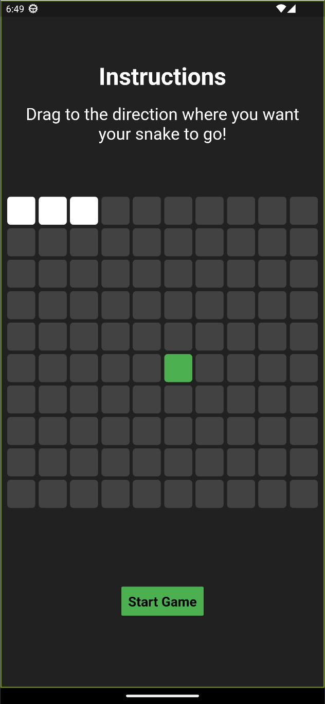
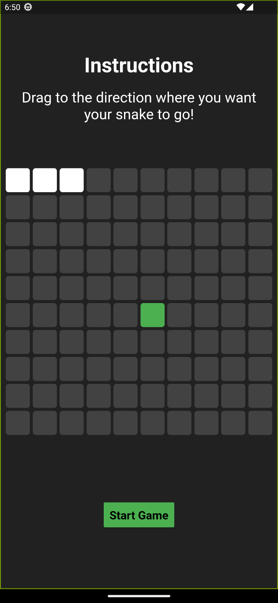

# Snake in Flutter

A classic Snake game implemented using Flutter framework.

## Screenshots

## Demo

## Getting Started

1. Install Flutter on your machine.
2. Clone this repository.
3. Open the project in your preferred IDE.
4. Run the app on an emulator or a physical device.

## How to Play

1. Click 'Start Game'
2. Swipe left, right, up or down anywhere within the cells to move the snake.
3. The snake grows as it eats the food.
4. The game ends when the snake collides with itself or with the boundaries of the screen.

## To be implemented
- Proper restart button
- Highscore records in Firebase